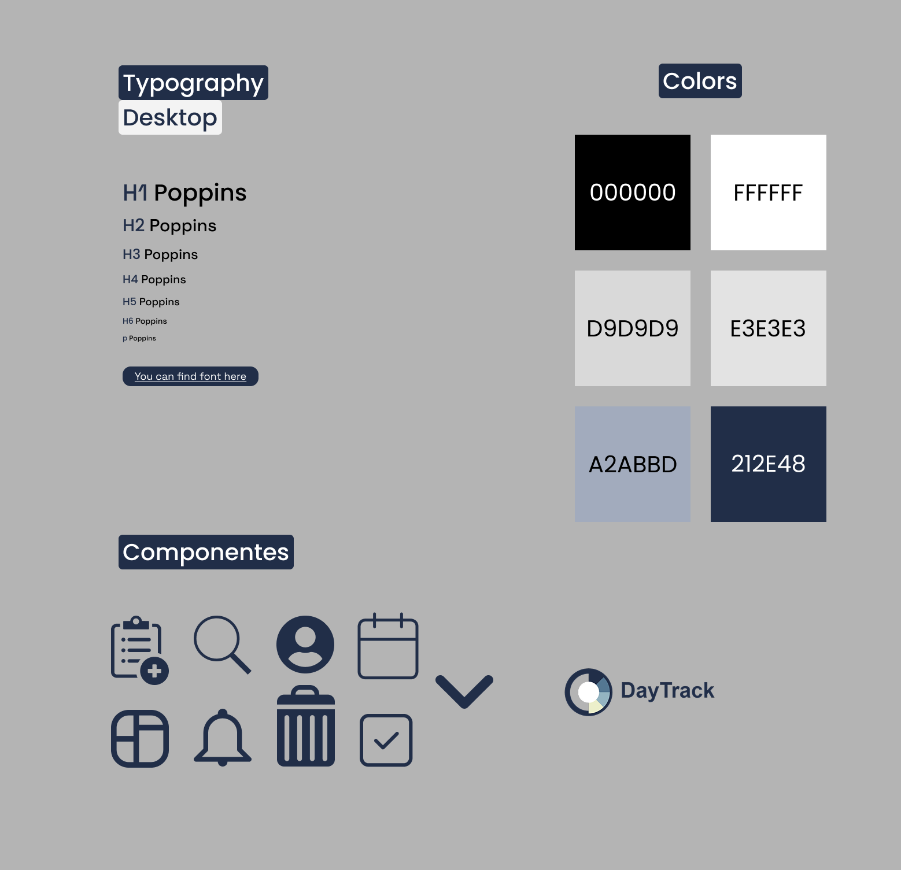
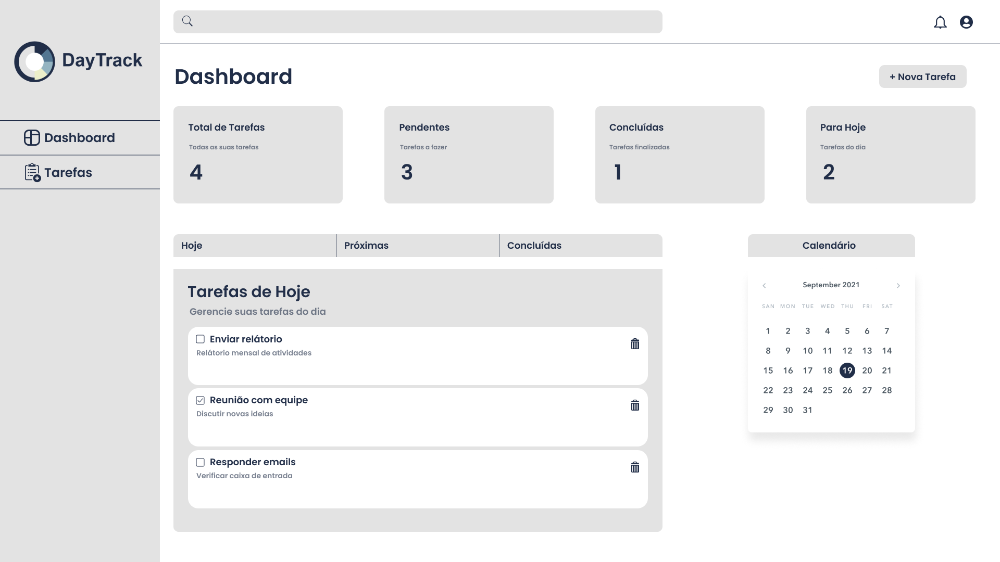
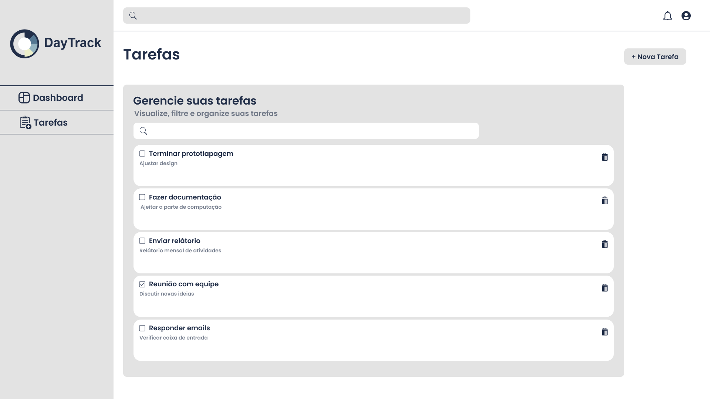
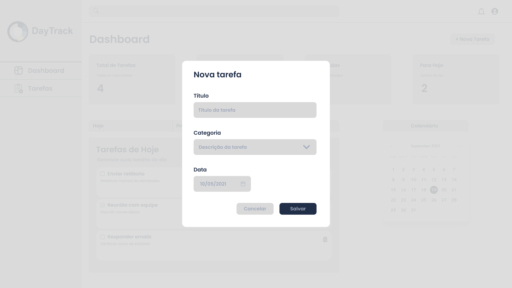
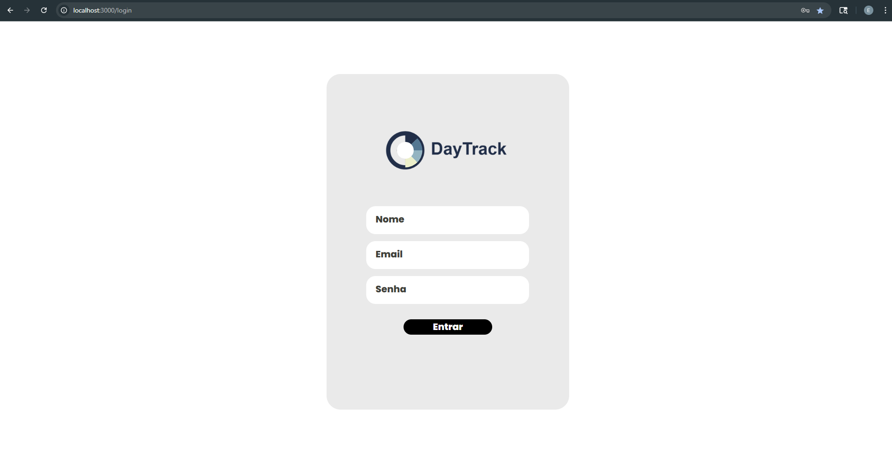
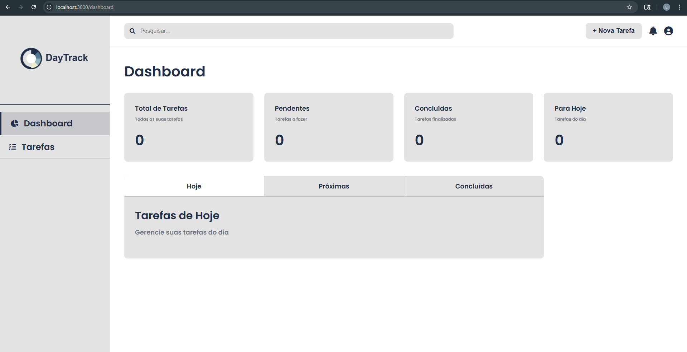
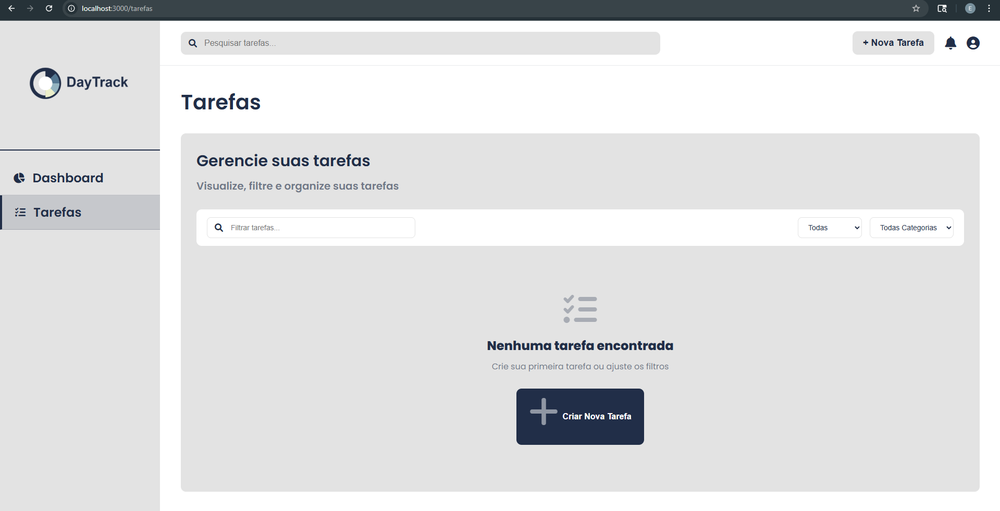
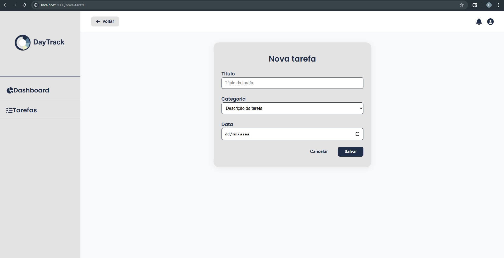

# Web Application Document - Projeto Individual - Módulo 2 - Inteli

## DayTrack

#### Autor do projeto: <a href="https://www.linkedin.com/in/enzo-piol-cerutti">Enzo Piol Cerutti</a> 

## Sumário

1. [Introdução](#c1)  
2. [Visão Geral da Aplicação Web](#c2)  
3. [Projeto Técnico da Aplicação Web](#c3)  
4. [Desenvolvimento da Aplicação Web](#c4)  
5. [Referências](#c5)  

<br>

## <a name="c1"></a>1. Introdução 

Este projeto é um gerenciador de tarefas focado no planejamento diário e produtividade pessoal, criado para quem busca algo além de uma lista de afazeres. A proposta é simples e inovadora o sistema não só organiza as tarefas do dia, mas também acompanha o progresso em tempo real e oferece um resumo visual de como o dia foi aproveitado.

Ao final do dia, o usuário pode verificar as atividades realizadas, mostrando a distribuição das tarefas por categoria e uma frase motivacional baseada no seu desempenho daquele dia. Isso ajuda a entender os hábitos diários e a planejar melhor os próximos dias.

O sistema também armazena o histórico dos dias anteriores e funciona totalmente no navegador, tornando a organização do dia a dia mais envolvente.


## <a name="c2"></a>2. Visão Geral da Aplicação Web

### 2.1. Personas 

Personas são perfis fictícios baseados em dados reais que representam usuários típicos de um sistema. Elas ajudam a entender melhor as motivações, necessidades e dores do público-alvo, facilitando decisões de design e desenvolvimento mais alinhadas com quem realmente vai usar o produto.[¹](#5-referências)

<div align="center">
  <sub>FIGURA 1 - Persona</sub><br>
  <br>
  <sup>Fonte: Material produzido pelo autor, 2025</sup>
</div>

Gabriel, 25 anos, é desenvolvedor de software e busca equilibrar sua rotina pessoal e profissional. Ele usa ferramentas como Trello, Google Calendar, Notion e GitHub, e se comunica por WhatsApp, Slack e e-mail. Seu objetivo é aumentar a produtividade e melhorar sua organização.

Ele precisa de uma solução simples e visual para planejar seu dia e acompanhar seu progresso sem ferramentas complexas. Seus desafios incluem manter o foco e lidar com a sobrecarga de tarefas.

A solução proposta é um sistema que monitora suas tarefas com uma barra de XP e, ao final do dia, gera um gráfico de desempenho, ajudando-o a se organizar melhor para os próximos dias.

### 2.2. User Stories 


| Identificação | US01 |
| --- | --- |
| **Persona** | Enzo |
| **User Story** | "Como usuário, quero visualizar minhas tarefas diárias em uma lista, para que eu possa marcar as que completei e acompanhar meu progresso durante o dia." |
| **Critério de aceite 1** | CR1: O usuário deve ser capaz de visualizar uma lista de tarefas do dia, com a opção de marcar as concluídas. |
| **Critério de aceite 2** | CR2: O sistema deve atualizar automaticamente a barra de XP conforme as tarefas são marcadas como concluídas. |
| **Critério de aceite 3** | CR3: O usuário deve ser capaz de visualizar o progresso da barra de XP em tempo real, com feedback visual. |
| **Critério de aceite 4** | CR4: A lista de tarefas deve ser clara e organizada, sem sobrecarga de informações. |
| **Critérios INVEST** | **Independente**: A funcionalidade de visualizar e marcar tarefas pode ser desenvolvida e testada de forma isolada, sem depender de outras partes do sistema. <br>**Negociável**: A maneira como as tarefas são exibidas ou marcadas pode ser ajustada conforme o feedback do usuário, sem comprometer o objetivo principal. <br> **Valiosa**: Esta funcionalidade ajuda diretamente na organização do dia, oferecendo um meio prático para que o usuário acompanhe o próprio desempenho. <br>**Estimável**: A funcionalidade é simples e direta, permitindo que o esforço de desenvolvimento seja estimado com facilidade por qualquer membro da equipe. <br>**Small (Pequena)**: Pode ser implementada em pouco tempo e com poucos recursos, sendo uma entrega rápida e funcional. <br> **Testável**: Os critérios de aceite são objetivos e claros, facilitando a criação de testes que garantam o correto funcionamento da funcionalidade. |

| Identificação | US02 |
| --- | --- |
| **Persona** | Cauã |
| **User Story** | "Como usuário, quero acessar um histórico dos meus dias anteriores, para acompanhar minha evolução e manter uma rotina mais consistente." |
| **Critério de aceite 1** | CR1: O sistema deve armazenar registros diários, data e frase exibida. |
| **Critério de aceite 2** | CR2: O usuário deve visualizar uma lista dos últimos dias. |
| **Critério de aceite 3** | CR3: Ao clicar em um dia do histórico, o sistema deve exibir o que foi feito aquele dia. |
| **Critério de aceite 4** | CR4: O histórico deve ser apresentado de forma simples e cronológica. |

| Identificação | US03 |
| --- | --- |
| **Persona** | Henrique |
| **User Story** | "Como usuária, quero adicionar uma nova tarefa com título, data e categoria, para que eu possa organizar melhor meu dia e acompanhar meu progresso com clareza." |
| **Critério de aceite 1** | CR1: O sistema deve permitir o preenchimento do título, data e categoria da tarefa.|
| **Critério de aceite 2** | CR2: A tarefa deve ser automaticamente adicionada à lista do dia selecionado, se a data corresponder ao atual. |
| **Critério de aceite 3** | CR3: A tarefa criada deve aparecer na visualização de tarefas imediatamente após ser salva.|
| **Critério de aceite 4** | CR4: A tarefa deve ser armazenada no banco e associada ao usuário logado. |

---

## <a name="c3"></a>3. Projeto da Aplicação Web

### 3.1. Modelagem do banco de dados  

Bancos de dados relacionais organizam informações em tabelas interligadas, facilitando o armazenamento, a consulta e a integridade dos dados em sistemas computacionais.[²](#5-referências)

<div align="center">
  <sub>FIGURA 2 - Modelagem do Banco de Dados</sub><br>
  <br>
  <sup>Fonte: Material produzido pelo autor, 2025</sup>
</div>

### Este é o modelo do banco de dados. Nele, há cinco tabelas que são elas: 

- **Tabela** **de** **Usuários:** Principal tabela da aplicação web, guarda os dados dos usuários cadastrados e é a tabela conectada com as tabelas tarefas e dias, pois um usuário pode ter várias tarefas e registros de dias. Logo, é uma relação 1 para N (1:N) com as tabelas tarefas e dias.

- **Tabela** **de** **Tarefas:** Guarda as tarefas criada pelos usuários, cada tarefa pertence a apenas um usuário e a uma única categoria. Logo, é uma relação N para 1 (N:1) com as tabelas de 
usuários e categorias.

- **Tabela** **de** **Categorias:** Irá armazenar as possíveis categorias de respectivas tarefas, uma categoria pode estar relacionada a várias tarefas. Logo, é uma relação 1 para N (1:N).

- **Tabela** **de** **Dias:** Armazena os dados sobre o desempenho do usuário, cada dia pertence a apenas um usuário e pode estar associado a uma única frase. Logo, é uma relação N para 1 (N:1) com as tabelas de usuários e frases.

- **Tabela** **de** **Frases:** Contém as frases motivacionais que o usuário irá receber ao final do dia, para poder verificar se a sua produtividade está no caminho certo ou se deve melhorar e cada frase pode estar ligada a vários registros de dias. Logo, é uma relação 1 para N (1:N) com a tabela de dias.

As mesma estão inseridas no código por meio de um arquivo .sql, localizado na pasta scripts...
### Sua organização é a seguinte: 

```sql
drop table if EXISTS tarefas;
drop table if EXISTS categorias;
drop table if EXISTS dias;
drop table if EXISTS frases;
drop table if EXISTS usuarios;

CREATE TABLE usuarios (
  id SERIAL PRIMARY KEY,
  nome TEXT NOT NULL,
  email TEXT UNIQUE NOT NULL,
  senha TEXT NOT NULL
);

CREATE TABLE categorias (
  id SERIAL PRIMARY KEY,
  nome TEXT NOT NULL
);

CREATE TABLE tarefas (
  id SERIAL PRIMARY KEY,
  titulo TEXT NOT NULL,
  concluida BOOLEAN DEFAULT FALSE,
  data DATE NOT NULL,
  usuario_id INTEGER NOT NULL REFERENCES usuarios(id) ON DELETE CASCADE,
  categoria_id INTEGER NOT NULL REFERENCES categorias(id) ON DELETE SET NULL
);

CREATE TABLE frases (
  id SERIAL PRIMARY KEY,
  texto TEXT NOT NULL,
  faixa_xp_min INTEGER NOT NULL,
  faixa_xp_max INTEGER NOT NULL
);

CREATE TABLE dias (
  id SERIAL PRIMARY KEY,
  data DATE NOT NULL,
  usuario_id INTEGER NOT NULL REFERENCES usuarios(id) ON DELETE CASCADE,
  xp NUMERIC(5,2) NOT NULL, 
  frase_id INTEGER REFERENCES frases(id),
  CONSTRAINT dia_unico_por_usuario UNIQUE (data, usuario_id)
);
```

Assim, com a implementação desse código, existe a criação do banco de dados que armazenará as informações do usuário, suas tarefas, categorias, frases e os dias de registro. Também ocorre a implementação das frases motivacionais que estão sendo adicionadas no banco por esse código:
```sql

INSERT INTO frases (texto, faixa_xp_min, faixa_xp_max) VALUES
('Todo começo é difícil, mas você deu o primeiro passo!', 0, 40),
('Não se cobre demais, amanhã é uma nova chance.', 0, 40),
('Pequenos avanços ainda são avanços!', 0, 40),
('A constância é mais importante que a velocidade.', 0, 40),
('Respire fundo. Você ainda está no jogo.', 0, 40);

INSERT INTO frases (texto, faixa_xp_min, faixa_xp_max) VALUES
('Bom trabalho! Você está no caminho certo.', 41, 80),
('Mais um dia produtivo, continue assim!', 41, 80),
('Seu esforço está rendendo resultados.', 41, 80),
('Você está construindo um hábito poderoso.', 41, 80),
('Parabéns por manter o ritmo!', 41, 80);

INSERT INTO frases (texto, faixa_xp_min, faixa_xp_max) VALUES
('Excelente! Seu dia foi extremamente produtivo!', 81, 100),
('Você mandou muito bem hoje, continue nessa pegada!', 81, 100),
('Sua dedicação está fazendo a diferença.', 81, 100),
('Produtividade em alta! Orgulho define.', 81, 100),
('Dia concluído com sucesso! Você merece comemorar.', 81, 100);
```
Desse modo, com esses códigos existe a adequação do banco de dados com o projeto.
### 3.1.1 BD e Models 
Os models implementados no sistema web são os seguintes:
```js
const db = require('../config/db');

class Usuario {
  static async listarTodos() {
    const result = await db.query('SELECT * FROM usuarios');
    return result.rows;
  }

  static async criar({ nome, email, senha }) {
    const result = await db.query(
      'INSERT INTO usuarios (nome, email, senha) VALUES ($1, $2, $3) RETURNING *',
      [nome, email, senha]
    );
    return result.rows[0];
  }
}
```
O model acima faz referencia a tabela de usuários do banco de dados, permitindo a manipulação dos dados referentes aos usuários. Em seguida, temos o model de categorias:
```js
const db = require('../config/db');

class Categoria {
  static async listarTodas() {
    const result = await db.query('SELECT * FROM categorias');
    return result.rows;
  }

  static async criar({ nome }) {
    const result = await db.query(
      'INSERT INTO categorias (nome) VALUES ($1) RETURNING *',
      [nome]
    );
    return result.rows[0];
  }
}
```
O model acima faz referencia a tabela de categorias do banco de dados, permitindo a manipulação dos dados referentes às categorias. Em seguida, temos o model de tarefas:
```js
const db = require('../config/db');

class Tarefa {
  static async listarTodas() {
    const result = await db.query('SELECT * FROM tarefas');
    return result.rows;
  }

  static async criar({ titulo, concluida, data, usuario_id, categoria_id }) {
    const result = await db.query(
      'INSERT INTO tarefas (titulo, concluida, data, usuario_id, categoria_id) VALUES ($1, $2, $3, $4, $5) RETURNING *',
      [titulo, concluida, data, usuario_id, categoria_id]
    );
    return result.rows[0];
  }
} 
```
O model acima faz referencia a tabela de tarefas do banco de dados, permitindo a manipulação dos dados referentes às tarefas. Em seguida, temos o model de dias:
```js
const db = require('../config/db');

class Dia {
  static async listarTodos() {
    const result = await db.query('SELECT * FROM dias');
    return result.rows;
  }

  static async criar({ data, usuario_id, xp, frase_id }) {
    const result = await db.query(
      'INSERT INTO dias (data, usuario_id, xp, frase_id) VALUES ($1, $2, $3, $4) RETURNING *',
      [data, usuario_id, xp, frase_id]
    );
    return result.rows[0];
  }
}

``` 
O model acima faz referencia a tabela de dias do banco de dados, permitindo a manipulação dos dados referentes aos dias. Em seguida, temos o model de frases:
```js
const db = require('../config/db');

class Frase {
  static async listarTodas() {
    const result = await db.query('SELECT * FROM frases');
    return result.rows;
  }

  static async buscarPorXP(xp) {
    const result = await db.query(
      'SELECT texto FROM frases WHERE $1 BETWEEN faixa_xp_min AND faixa_xp_max LIMIT 1',
      [xp]
    );
    return result.rows[0];
  }
}

module.exports = Frase;
```
O model acima faz referencia a tabela de frases do banco de dados, permitindo a manipulação dos dados referentes às frases.

### 3.2. Arquitetura 
A arquitetura MVC é um padrão de organização de software que separa a aplicação em três camadas principais: o Modelo, a Visão e o Controlador. Essa separação facilita a manutenção e escalabilidade do código.[³](#5-referências)

<div align="center">
  <sub>FIGURA 3 - Arquitetura MVC</sub><br>
  <br>
  <sup>Fonte: Material produzido pelo autor, 2025</sup>
</div>

Existem os controllers dedicados a usuários, tarefas, categorias, dias e frases, a aplicação gerencia ações do usuário e interage com models que representam as tabelas do banco de dados. As rotas são necessárias para fazer as requisições da aplicação, e a aplicação é executada com Node.js e Express, garantindo comunicação eficiente com o banco de dados. As views são desenvolvidas com EJS e organizadas em páginas como login, dashboard, tarefas e nova tarefa, permitindo ao usuário interagir com o sistema de forma clara e objetiva.

### 3.3. Wireframes 

Os wireframes mostram a estrutura básica da página e como ela será organizada. São dividias em 3 tipos: baixa, média e alta fidelidade. Os wireframes a seguir estão padronizados em baixa fidelidade.[⁴](#5-referências)

<div align="center">
  <sub>FIGURA 4 - Wireframe Do DayTrack</sub><br>
  <br>
  <sup>Fonte: Material produzido pelo autor, 2025</sup>
</div>

link do figma para acesso aos itens do WAD: https://www.figma.com/design/kF7ZSWzqVe7hkX6vNPTmB2/figma-pessoal?node-id=0-1&p=f&t=WoXsyOiPXFFeGblD-0


Na primeira tela, é possível visualizar a tela de login, na qual o usuário irá cadastrar seus dados para conseguir usufruir da aplicação web. Após o login, o usuário será direcionado para a tela do dashboard, onde terá acesso a todas as suas tarefas e poderá defini-las como a fazer, em andamento ou concluídas. Ao clicar no botão de adicionar, na mesma tela, o usuário poderá incluir uma nova tarefa. No barra lateral ao clicar em tarefas, também será possível visualizar todas as tarefas adicionadas, permitindo verificar quantas ainda faltam ou se o seu progresso está adequado.


### 3.4. Guia de estilos 

Um guia de estilos é um documento que define padrões visuais e de linguagem para garantir consistência e identidade em um sistema ou produto digital.[⁵](#5-referências)

<div align="center">
  <sub>FIGURA 5 - Guia De Estilos</sub><br>
  <br>
  <sup>Fonte: Material produzido pelo autor, 2025</sup>
</div>

A imagem acima se refere ao guia de estilos do dayTrack, onde é mostrada a tipografia, as cores e os componentes da aplicação.

Sobre a tipografia está sendo utilizada a fonte poppins, a qual está aplicada para todo o projeto desde H1 até H6 mantendo a consistêcia visual entre todas as telas da aplicação.

Em seguida, a paleta de cores é composta por tons neutros e azulados, garantindo contraste e leveza visual:

- #000000 (preto) e #FFFFFF (branco): cores de contraste base.

- #D9D9D9 e #E3E3E3: cinzas claros usados para fundo e separação de blocos.

- #A2ABBD e #212E48: tons principais de azul usados em botões, ícones e destaques, trazendo identidade ao sistema.

Por fim, existem os componente visuais, os ícones utilizados representam ações e seções principais do sistema de modo que todos seguem um estilo uniforme, reforçando a identidade visual do produto.
### 3.5. Protótipo de alta fidelidade 

Um protótipo de alta fidelidade é uma representação visual quase final de um sistema, que simula com precisão a aparência, funcionalidades e interações da interface real.[⁶](#5-referências)

<div align="center">
<sub>FIGURA 6 - Tela de Login</sub><br>
<br>
<sup>Fonte: Material produzido pelo autor, 2025</sup>
</div>

<br>
A tela de login é a primeira interface apresentada, onde o usuário insere seu nome, e-mail e senha para acessar o sistema. Essas informações são armazenadas para futuras reconexões.
<br>

<div align="center">
<sub>FIGURA 7 - Tela de Dashboard</sub><br>
<br>
<sup>Fonte: Material produzido pelo autor, 2025</sup>
</div>

Após o login, o usuário é direcionado ao dashboard. Esta tela oferece uma visão geral da aplicação, exibindo as tarefas do dia, o calendário e a quantidade de tarefas pendentes.

<div align="center">
<sub>FIGURA 8 - Tela de Tarefas</sub><br>
<br>
<sup>Fonte: Material produzido pelo autor, 2025</sup>
</div>

Ao clicar no botão "Tarefas" na barra lateral, o usuário visualiza todas as suas tarefas disponíveis, podendo gerenciá-las, editá-las ou excluí-las conforme necessário.

<div align="center">
<sub>FIGURA 9 - Tela de Criar Tarefas</sub><br>
<br>
<sup>Fonte: Material produzido pelo autor, 2025</sup>
</div>

Por fim, ao selecionar a opção "Nova Tarefa", o usuário é direcionado à tela de criação de tarefas, onde pode adicionar uma nova tarefa preenchendo campos como título, categoria e data.

Segue em anexo o link para visualização do protótipo: https://www.figma.com/design/kF7ZSWzqVe7hkX6vNPTmB2/figma-pessoal?node-id=103-2&p=f&t=XQNQlIoE6WAgDW8d-0

### 3.6. WebAPI e endpoints 

A seguir estão descritos os principais endpoints da API do sistema DayTrack, organizados por entidade. Todos seguem o padrão REST e utilizam o prefixo `/api`.

#### Usuários (`/api/usuarios`)
- `GET /api/usuarios` – Lista todos os usuários cadastrados.
- `POST /api/usuarios` – Cria um novo usuário.
- `PUT /api/usuarios/:id` – Atualiza os dados de um usuário existente.
- `DELETE /api/usuarios/:id` – Remove um usuário com base no ID.

#### Tarefas (`/api/tarefas`)
- `GET /api/tarefas` – Lista todas as tarefas do sistema.
- `POST /api/tarefas` – Cria uma nova tarefa com título, data e categoria.
- `PUT /api/tarefas/:id` – Edita uma tarefa específica.
- `DELETE /api/tarefas/:id` – Exclui uma tarefa pelo ID.

#### Dias (`/api/dias`)
- `GET /api/dias` – Retorna os registros de produtividade dos dias.
- `POST /api/dias` – Registra um novo dia com XP e frase.
- `PUT /api/dias/:id` – Atualiza os dados de um dia específico.
- `DELETE /api/dias/:id` – Remove um dia do histórico.

#### Categorias (`/api/categorias`)
- `GET /api/categorias` – Lista todas as categorias de tarefas.
- `POST /api/categorias` – Cria uma nova categoria.
- `PUT /api/categorias/:id` – Atualiza uma categoria existente.
- `DELETE /api/categorias/:id` – Exclui uma categoria pelo ID.

#### Frases Motivacionais (`/api/frases`)
- `GET /api/frases` – Lista todas as frases motivacionais disponíveis.
- `GET /api/frases/xp/:xp` – Retorna uma frase baseada na faixa de XP informada.


### 3.7 Interface e Navegação 

### Login

A primeira tela desenvolvida na aplicação foi a tela de login, que apresenta uma interface simplificada e de fácil uso para o usuário. A seguir, é apresentada uma demonstração visual dessa tela. Ela já está conectada ao banco de dados e realiza a verificação de credenciais, identificando se o usuário está utilizando um login válido. Com base nessa validação, o sistema permite ou bloqueia o acesso às funcionalidades do DayTrack.

<div align="center">
<sub>FIGURA 10 - Login Aplicado ao LocalHost</sub><br>
<br>
<sup>Fonte: Material produzido pelo autor, 2025</sup>
</div>


A tela foi implementada em EJS e está localizada no arquivo views/pages/login.ejs, com estilização aplicada por meio do arquivo views/css/login.css. A lógica de autenticação está conectada ao backend via rota em routes/frontRoutes.js, que por sua vez chama o usarioController.js, responsável por verificar os dados enviados e consultar o banco de dados para validar o login. O formulário envia as informações via método POST, e em caso de sucesso, o usuário é redirecionado para o dashboard. A interface é responsiva e apresenta um design minimalista, alinhado à identidade visual do sistema.

---

### Dashboard
A segunda tela implementada na aplicação foi o dashboard, que serve como a área principal de visualização e acompanhamento das tarefas do usuário. Nessa interface, é possível observar um resumo das atividades do dia, com contadores de tarefas totais, pendentes, concluídas e programadas especificamente para o dia atual. A tela foi desenvolvida em EJS, no arquivo views/pages/dashboard.ejs, com dados dinâmicos fornecidos pelo banco de dados através do tarefaController.js. As informações são buscadas e repassadas à view por meio da rota definida em frontRoutes.js, utilizando res.render() para renderizar os dados.

O exemplo da tela na aplicação é a seguinte:

<div align="center">
<sub>FIGURA 11 - Dashboard Aplicado ao LocalHost</sub><br>
<br>
<sup>Fonte: Material produzido pelo autor, 2025</sup>
</div>

Visualmente, a página apresenta um layout limpo e organizado, com estilização feita em CSS na pasta public/css, seguindo o guia de estilos previamente definido. O menu lateral permite a navegação entre as principais seções do sistema, como Dashboard e Tarefas. Já o conteúdo principal mostra os cards de resumo e uma área de abas que permitirá ao usuário alternar entre tarefas de hoje, próximas ou concluídas. Conforme imagem abaixo, a interface está integrada ao backend e já recebe os dados reais do sistema, prontos para futura expansão com interação via Fetch API.

---
### Tarefas

A tela de tarefas foi desenvolvida com o objetivo de permitir que o usuário visualize, filtre e organize suas tarefas de forma prática. A interface conta com um campo de busca, filtros por status e categoria, além de um botão de atalho para criar uma nova tarefa. Quando não há tarefas cadastradas ou os filtros não retornam resultados, a tela exibe uma mensagem informativa com a opção de iniciar o primeiro cadastro.

<div align="center">
<sub>FIGURA 12 - Tarefas Aplicado ao LocalHost</sub><br>
<br>
<sup>Fonte: Material produzido pelo autor, 2025</sup>
</div>

Essa view foi construída no arquivo views/pages/tarefa.ejs, consumindo dados do banco por meio do tarefaController.js, e é renderizada através das rotas definidas em frontRoutes.js. A estilização foi feita com base no guia visual do projeto, utilizando CSS localizado em views/css/tarefas.css, garantindo alinhamento com a identidade do DayTrack. A navegação lateral permanece visível, mantendo a consistência entre as páginas da aplicação. 

---
### Nova Tarefa
A tela de cadastro de nova tarefa foi implementada para permitir que o usuário adicione manualmente atividades ao sistema. A interface apresenta um formulário simples e centralizado com campos para o título da tarefa, seleção da categoria e data prevista. A ação de salvar envia os dados para o backend, utilizando o método POST para inserção no banco de dados. Esta view está localizada no arquivo views/pages/novaTarefa.ejs, sendo ativada pela rota /nova-tarefa, definida no frontRoutes.js.

<div align="center">
<sub>FIGURA 13 - Nova-Tarefa Aplicado ao LocalHost</sub><br>
<br>
<sup>Fonte: Material produzido pelo autor, 2025</sup>
</div>
Ao preencher o formulário e clicar em “Salvar”, os dados são tratados no tarefaController.js, que se comunica diretamente com o banco de dados para registrar a nova tarefa. A estilização segue o guia visual do DayTrack, com espaçamentos generosos, botões com feedback visual e tipografia consistente. A navegação lateral e o botão “Voltar” garantem uma boa usabilidade e retorno rápido às demais seções da aplicação. 

---

## <a name="c4"></a>4. Desenvolvimento da Aplicação Web 

### 4.1 Demonstração do Sistema Web 
<div align="center">
  <sub>VÍDEO 1 - Demonstração DayTrack</sub><br>
  <video width="100%" controls>
    <source src="../documentos/assetsWad/Video Demonstração DayTrack.mp4" type="video/mp4">
  </video><br>
  <sup>Fonte: Material produzido pelo autor, 2025</sup>
</div>

Link para visualização do vídeo: https://drive.google.com/file/d/1Db-gxaM_kvB1BPhX8b5wfdZsjpcfJA3e/view?usp=sharing

O desenvolvimento do sistema DayTrack foi realizado utilizando a arquitetura MVC, com backend em Node.js e Express, banco de dados PostgreSQL e interface construída com EJS, CSS e JavaScript. Ao longo do projeto, foram implementadas funcionalidades completas de cadastro, listagem e gerenciamento de tarefas, além de um sistema de autenticação de usuários.

O código foi organizado em camadas separadas: Models para manipulação dos dados, Controllers para a lógica de negócio, Views para a interface do usuário e Routes para o controle das requisições. A integração entre frontend e backend foi feita por meio de rotas express e consumo de API com Fetch.

O sistema apresenta telas como Login, Dashboard com resumo das tarefas, listagem de todas as tarefas cadastradas e o formulário para criação de novas tarefas. Toda a comunicação com o banco de dados é feita de forma dinâmica, refletindo os dados em tempo real na interface. 

### 4.2 Conclusões e Trabalhos Futuros 

O desenvolvimento do DayTrack permitiu a aplicação prática de conceitos de backend, frontend e banco de dados, consolidando o aprendizado sobre a arquitetura MVC e integração entre diferentes camadas do sistema. Como ponto forte, destaca-se a organização estrutural do código, a implementação de um CRUD funcional para tarefas e a utilização de um design simples e objetivo, alinhado ao guia de estilos definido.

Por outro lado, alguns pontos podem ser aprimorados em versões futuras, como a implementação de filtros mais avançados para as tarefas, a criação de um sistema de autenticação com níveis de acesso e a adição de gráficos mais detalhados para análise de produtividade. Também é possível futuramente integrar notificações por e-mail e permitir que o usuário personalize as frases motivacionais.

Além disso, uma evolução interessante seria a criação de um painel de histórico mais completo, com visualização por semana ou mês, e a inclusão de funcionalidades responsivas para adaptar melhor a aplicação a dispositivos móveis.


## <a name="c5"></a>5. Referências
<p>
1. COOPER, Alan; REIMANN, Robert; CRONIN, David. About Face 3: The Essentials of Interaction Design. Indianapolis: Wiley, 2007.
</p>

<p>
2. DATE, C. J. Introdução a Sistemas de Bancos de Dados. 8. ed. Rio de Janeiro: Elsevier, 2004.
</p>

<p>
3. GAMMA, Erich et al. Padrões de Projeto: soluções reutilizáveis de software orientado a objetos. Porto Alegre: Bookman, 2000.
</p>

<p>
4. PREECE, Jennifer; ROGERS, Yvonne; SHARP, Helen. Design de interação: além da interação homem-computador. Porto Alegre: Bookman, 2011.
</p>

<p>
5. NIELSEN, Jakob. Design de interação: princípios para a interação homem-computador. Rio de Janeiro: Elsevier, 2010.
</p>

<p>
6. SILVA, Tatiana Amorim da; BARBOSA, Simone Diniz Junqueira. Prototipação no design de interação. In: BARBOSA, Simone Diniz Junqueira. Interação humano-computador. Rio de Janeiro: Elsevier, 2010. p. 365–390.
</p>
