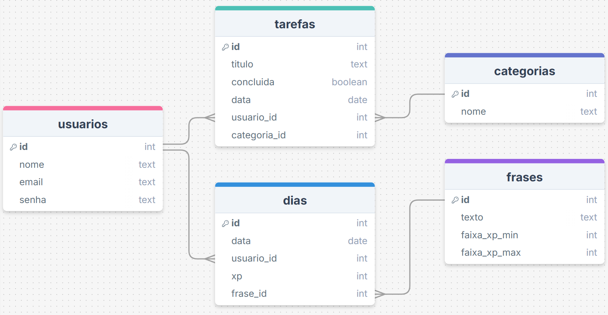

# Web Application Document - Projeto Individual - Módulo 2 - Inteli

## DayTrack
 
#### Autor do projeto: <a href="https://www.linkedin.com/in/enzo-piol-cerutti">Enzo Piol Cerutti</a> 

## Sumário

1. [Introdução](#c1)  
2. [Visão Geral da Aplicação Web](#c2)  
3. [Projeto Técnico da Aplicação Web](#c3)  
4. [Desenvolvimento da Aplicação Web](#c4)  
5. [Referências](#c5)  

<br>

## <a name="c1"></a>1. Introdução 

Este projeto é um gerenciador de tarefas focado no planejamento diário e produtividade pessoal, criado para quem busca algo além de uma lista de afazeres. A proposta é simples e inovadora o sistema não só organiza as tarefas do dia, mas também acompanha o progresso em tempo real e oferece um resumo visual de como o dia foi aproveitado.

O principal diferencial é a barra de XP, inspirada em mecânicas de jogos, que é preenchida à medida que as tarefas venham a ser concluídas. A lógica é simples, tarefas feitas divididas pelo total de tarefas, com uma barra animada que muda de cor conforme o progresso (de vermelho para verde).

Ao final do dia, o usuário pode verificar as atividades realizadas, mostrando a distribuição das tarefas por categoria e uma frase motivacional baseada no seu desempenho daquele dia. Isso ajuda a entender os hábitos diários e a planejar melhor os próximos dias.

O sistema também armazena o histórico dos dias anteriores e funciona totalmente no navegador, tornando a organização do dia a dia mais envolvente.

---

## <a name="c2"></a>2. Visão Geral da Aplicação Web

### 2.1. Personas 

Personas são perfis fictícios baseados em dados reais que representam usuários típicos de um sistema. Elas ajudam a entender melhor as motivações, necessidades e dores do público-alvo, facilitando decisões de design e desenvolvimento mais alinhadas com quem realmente vai usar o produto.[¹](#5-referências)

<div align="center">
  <sub>FIGURA 1 - Persona</sub><br>
  <br>
  <sup>Fonte: Material produzido pelo autor, 2025</sup>
</div>

Gabriel, 25 anos, é desenvolvedor de software e busca equilibrar sua rotina pessoal e profissional. Ele usa ferramentas como Trello, Google Calendar, Notion e GitHub, e se comunica por WhatsApp, Slack e e-mail. Seu objetivo é aumentar a produtividade e melhorar sua organização.

Ele precisa de uma solução simples e visual para planejar seu dia e acompanhar seu progresso sem ferramentas complexas. Seus desafios incluem manter o foco e lidar com a sobrecarga de tarefas.

A solução proposta é um sistema que monitora suas tarefas com uma barra de XP e, ao final do dia, gera um gráfico de desempenho, ajudando-o a se organizar melhor para os próximos dias.

### 2.2. User Stories 


| Identificação | US01 |
| --- | --- |
| **Persona** | Enzo |
| **User Story** | "Como usuário, quero visualizar minhas tarefas diárias em uma lista, para que eu possa marcar as que completei e acompanhar meu progresso durante o dia." |
| **Critério de aceite 1** | CR1: O usuário deve ser capaz de visualizar uma lista de tarefas do dia, com a opção de marcar as concluídas. |
| **Critério de aceite 2** | CR2: O sistema deve atualizar automaticamente a barra de XP conforme as tarefas são marcadas como concluídas. |
| **Critério de aceite 3** | CR3: O usuário deve ser capaz de visualizar o progresso da barra de XP em tempo real, com feedback visual. |
| **Critério de aceite 4** | CR4: A lista de tarefas deve ser clara e organizada, sem sobrecarga de informações. |
| **Critérios INVEST** | **Independente**: A funcionalidade de visualizar e marcar tarefas pode ser desenvolvida e testada de forma isolada, sem depender de outras partes do sistema. <br>**Negociável**: A maneira como as tarefas são exibidas ou marcadas pode ser ajustada conforme o feedback do usuário, sem comprometer o objetivo principal. <br> **Valiosa**: Esta funcionalidade ajuda diretamente na organização do dia, oferecendo um meio prático para que o usuário acompanhe o próprio desempenho. <br>**Estimável**: A funcionalidade é simples e direta, permitindo que o esforço de desenvolvimento seja estimado com facilidade por qualquer membro da equipe. <br>**Small (Pequena)**: Pode ser implementada em pouco tempo e com poucos recursos, sendo uma entrega rápida e funcional. <br> **Testável**: Os critérios de aceite são objetivos e claros, facilitando a criação de testes que garantam o correto funcionamento da funcionalidade. |

| Identificação | US02 |
| --- | --- |
| **Persona** | Cauã |
| **User Story** | "Como usuário, quero visualizar uma barra de XP que represente minha produtividade do dia, para que eu possa me motivar e acompanhar meu desempenho em tempo real." |
| **Critério de aceite 1** | CR1: O sistema deve calcular a porcentagem de tarefas concluídas em relação ao total do dia. |
| **Critério de aceite 2** | CR2: A barra de XP deve ser atualizada automaticamente conforme as tarefas forem marcadas como concluídas. |
| **Critério de aceite 3** | CR3: A barra de XP deve ser animada e mudar de cor com base no progresso (ex: vermelho, amarelo, verde). |
| **Critério de aceite 4** | CR4: O usuário deve visualizar o percentual de progresso junto à barra de XP. |

| Identificação | US03 |
| --- | --- |
| **Persona** | Henrique |
| **User Story** | "Como usuário, quero visualizar um resumo gráfico ao final do dia com categorias das tarefas realizadas, para que eu possa entender melhor minha produtividade e áreas de foco." |
| **Critério de aceite 1** | CR1: O sistema deve permitir classificar cada tarefa por categoria (ex: trabalho, estudos, lazer). |
| **Critério de aceite 2** | CR2: O resumo do dia deve ser gerado após o clique no botão 'Finalizar Dia'. |
| **Critério de aceite 3** | CR3: O sistema deve apresentar um gráfico de pizza com a proporção de tarefas por categoria. |
| **Critério de aceite 4** | CR4: Deve ser exibida uma mensagem motivacional com base no desempenho do usuário. |

---

## <a name="c3"></a>3. Projeto da Aplicação Web

### 3.1. Modelagem do banco de dados  

Bancos de dados relacionais organizam informações em tabelas interligadas, facilitando o armazenamento, a consulta e a integridade dos dados em sistemas computacionais.[²](#5-referências)

<div align="center">
  <sub>FIGURA 2 - Modelagem do Banco de Dados</sub><br>
  <br>
  <sup>Fonte: Material produzido pelo autor, 2025</sup>
</div>

### Este é o modelo do banco de dados. Nele, há cinco tabelas que são elas: 

- **Tabela** **de** **Usuários:** Principal tabela da aplicação web, guarda os dados dos usuários cadastrados e é a tabela conectada com as tabelas tarefas e dias, pois um usuário pode ter várias tarefas e registros de dias. Logo, é uma relação 1 para N (1:N) com as tabelas tarefas e dias.

- **Tabela** **de** **Tarefas:** Guarda as tarefas criada pelos usuários, cada tarefa pertence a apenas um usuário e a uma única categoria. Logo, é uma relação N para 1 (N:1) com as tabelas de 
usuários e categorias.

- **Tabela** **de** **Categorias:** Irá armazenar as possíveis categorias de respectivas tarefas, uma categoria pode estar relacionada a várias tarefas. Logo, é uma relação 1 para N (1:N).

- **Tabela** **de** **Dias:** Armazena os dados sobre o desempenho do usuário, cada dia pertence a apenas um usuário e pode estar associado a uma única frase. Logo, é uma relação N para 1 (N:1) com as tabelas de usuários e frases.

- **Tabela** **de** **Frases:** Contém as frases motivacionais que o usuário irá receber ao final do dia, para poder verificar se a sua produtividade está no caminho certo ou se deve melhorar e cada frase pode estar ligada a vários registros de dias. Logo, é uma relação 1 para N (1:N) com a tabela de dias.

As mesma estão inseridas no código por meio de um arquivo .sql, localizado na pasta scripts...
### Sua organização é a seguinte: 

```sql
drop table if EXISTS tarefas;
drop table if EXISTS categorias;
drop table if EXISTS dias;
drop table if EXISTS frases;
drop table if EXISTS usuarios;

CREATE TABLE usuarios (
  id SERIAL PRIMARY KEY,
  nome TEXT NOT NULL,
  email TEXT UNIQUE NOT NULL,
  senha TEXT NOT NULL
);

CREATE TABLE categorias (
  id SERIAL PRIMARY KEY,
  nome TEXT NOT NULL
);

CREATE TABLE tarefas (
  id SERIAL PRIMARY KEY,
  titulo TEXT NOT NULL,
  concluida BOOLEAN DEFAULT FALSE,
  data DATE NOT NULL,
  usuario_id INTEGER NOT NULL REFERENCES usuarios(id) ON DELETE CASCADE,
  categoria_id INTEGER NOT NULL REFERENCES categorias(id) ON DELETE SET NULL
);

CREATE TABLE frases (
  id SERIAL PRIMARY KEY,
  texto TEXT NOT NULL,
  faixa_xp_min INTEGER NOT NULL,
  faixa_xp_max INTEGER NOT NULL
);

CREATE TABLE dias (
  id SERIAL PRIMARY KEY,
  data DATE NOT NULL,
  usuario_id INTEGER NOT NULL REFERENCES usuarios(id) ON DELETE CASCADE,
  xp NUMERIC(5,2) NOT NULL, 
  frase_id INTEGER REFERENCES frases(id),
  CONSTRAINT dia_unico_por_usuario UNIQUE (data, usuario_id)
);
```

Assim, com a implementação desse código, existe a criação do banco de dados que armazenará as informações do usuário, suas tarefas, categorias, frases e os dias de registro. Também ocorre a implementação das frases motivacionais que estão sendo adicionadas no banco por esse código:
```sql

INSERT INTO frases (texto, faixa_xp_min, faixa_xp_max) VALUES
('Todo começo é difícil, mas você deu o primeiro passo!', 0, 40),
('Não se cobre demais, amanhã é uma nova chance.', 0, 40),
('Pequenos avanços ainda são avanços!', 0, 40),
('A constância é mais importante que a velocidade.', 0, 40),
('Respire fundo. Você ainda está no jogo.', 0, 40);

INSERT INTO frases (texto, faixa_xp_min, faixa_xp_max) VALUES
('Bom trabalho! Você está no caminho certo.', 41, 80),
('Mais um dia produtivo, continue assim!', 41, 80),
('Seu esforço está rendendo resultados.', 41, 80),
('Você está construindo um hábito poderoso.', 41, 80),
('Parabéns por manter o ritmo!', 41, 80);

INSERT INTO frases (texto, faixa_xp_min, faixa_xp_max) VALUES
('Excelente! Seu dia foi extremamente produtivo!', 81, 100),
('Você mandou muito bem hoje, continue nessa pegada!', 81, 100),
('Sua dedicação está fazendo a diferença.', 81, 100),
('Produtividade em alta! Orgulho define.', 81, 100),
('Dia concluído com sucesso! Você merece comemorar.', 81, 100);
```
Desse modo, com esses códigos existe a adequação do banco de dados com o projeto.
### 3.1.1 BD e Models (Semana 5)
*Descreva aqui os Models implementados no sistema web*

### 3.2. Arquitetura (Semana 5)

*Posicione aqui o diagrama de arquitetura da sua solução de aplicação web. Atualize sempre que necessário.*

**Instruções para criação do diagrama de arquitetura**  
- **Model**: A camada que lida com a lógica de negócios e interage com o banco de dados.
- **View**: A camada responsável pela interface de usuário.
- **Controller**: A camada que recebe as requisições, processa as ações e atualiza o modelo e a visualização.
  
*Adicione as setas e explicações sobre como os dados fluem entre o Model, Controller e View.*

### 3.3. Wireframes 

Os wireframes mostram a estrutura básica da página e como ela será organizada. São dividias em 3 tipos: baixa, média e alta fidelidade. Os wireframes a seguir estão padronizados em baixa fidelidade.[³](#5-referências)

<div align="center">
  <sub>FIGURA 3 - Wireframe Do DayTrack</sub><br>
  <br>
  <sup>Fonte: Material produzido pelo autor, 2025</sup>
</div>

link do figma para acesso aos itens do WAD: https://www.figma.com/design/kF7ZSWzqVe7hkX6vNPTmB2/figma-pessoal?node-id=0-1&p=f&t=WoXsyOiPXFFeGblD-0
<br>

Na primeira tela, é possível visualizar a tela de login, na qual o usuário irá cadastrar seus dados para conseguir usufruir da aplicação web. Após o login, o usuário será direcionado para a tela do dashboard, onde terá acesso a todas as suas tarefas e poderá defini-las como a fazer, em andamento ou concluídas. Ao clicar no botão de adicionar, na mesma tela, o usuário poderá incluir uma nova tarefa. No barra lateral ao clicar em tarefas, também será possível visualizar todas as tarefas adicionadas, permitindo verificar quantas ainda faltam ou se o seu progresso está adequado.


### 3.4. Guia de estilos (Semana 05)

*Descreva aqui orientações gerais para o leitor sobre como utilizar os componentes do guia de estilos de sua solução.*


### 3.5. Protótipo de alta fidelidade (Semana 05)

*Posicione aqui algumas imagens demonstrativas de seu protótipo de alta fidelidade e o link para acesso ao protótipo completo (mantenha o link sempre público para visualização).*

### 3.6. WebAPI e endpoints (Semana 05)

*Utilize um link para outra página de documentação contendo a descrição completa de cada endpoint. Ou descreva aqui cada endpoint criado para seu sistema.*  

### 3.7 Interface e Navegação (Semana 07)

*Descreva e ilustre aqui o desenvolvimento do frontend do sistema web, explicando brevemente o que foi entregue em termos de código e sistema. Utilize prints de tela para ilustrar.*

---

## <a name="c4"></a>4. Desenvolvimento da Aplicação Web (Semana 8)

### 4.1 Demonstração do Sistema Web (Semana 8)

*VIDEO: Insira o link do vídeo demonstrativo nesta seção*
*Descreva e ilustre aqui o desenvolvimento do sistema web completo, explicando brevemente o que foi entregue em termos de código e sistema. Utilize prints de tela para ilustrar.*

### 4.2 Conclusões e Trabalhos Futuros (Semana 8)

*Indique pontos fortes e pontos a melhorar de maneira geral.*
*Relacione também quaisquer outras ideias que você tenha para melhorias futuras.*


## <a name="c5"></a>5. Referências
<p>
1. COOPER, Alan; REIMANN, Robert; CRONIN, David. About Face 3: The Essentials of Interaction Design. Indianapolis: Wiley, 2007.
</p>

<p>
2. DATE, C. J. Introdução a Sistemas de Bancos de Dados. 8. ed. Rio de Janeiro: Elsevier, 2004.
</p>

<p>
3. PREECE, Jennifer; ROGERS, Yvonne; SHARP, Helen. Design de interação: além da interação homem-computador. Porto Alegre: Bookman, 2011.
</p>
<br>
